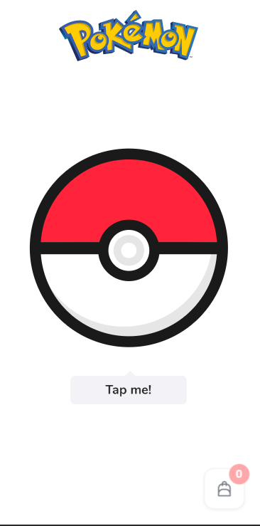
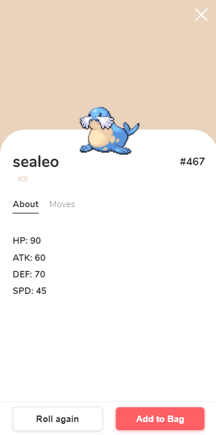
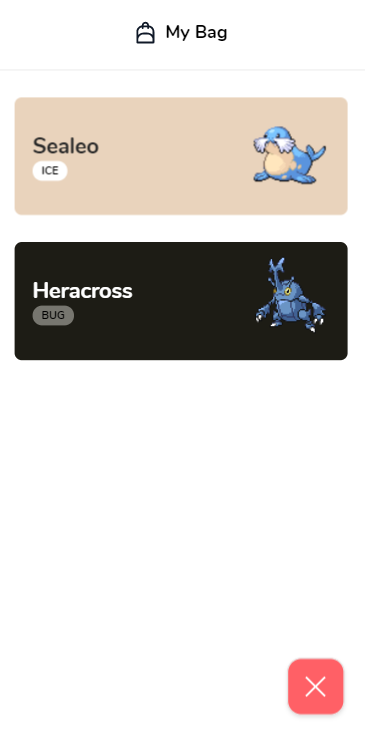

# pokemon-roller-v2 mobile edition
## Second version of app that lets user roll a Pokemon and add it to his 'backpack'.
  
### Tech stack:
- HTML
- CSS + SCSS (using BEM methodics)
- Vanilla JavaScript
- ColorThief, Hammer.js and Tinycolor npm packages
### Demo: https://lukaszkoziorowski.github.io/pokemon-roller-v2/
